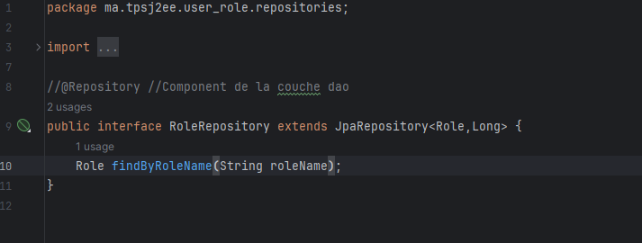
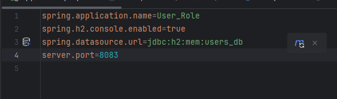

<h3>Compte Rendu</h3>
<h4>1/Entities:</h4>
<h5>User</h5>

<h6>--Base de donnees MySQl--</h6>

<h6>--Base de donnees h2--</h6>

<h5>Role</h5>

<h6>--Base de donnees h2--</h6>

<h6>--Base de donnees MySQL--</h6>

<h5>RoleUsers</h5>
<h6>--Base de donnees h2--</h6>

<h6>--Base de donnees MySQL--</h6>

<h4>2/Services:</h4>

<h5>2.1/ Implementation Ajout</h5>

<h5>2.2/ Implementation Ajout Role User</h5>

<h5>2.3/ Implementation Recherche</h5>

<h4>3/Repositories:</h4>
<h5>3.1/ Role</h5>

<h5>3.2/ User</h5>

<h4>4/Presentation</h4>
<h5>4.1/ Presentation Ajout</h5>

<h5>3.2/ Presentation Authentification</h5>

<h4>Authentification Console</h4>

<h4>Application Properties</h4>
<h5>1.H2 database</h5>

<h5>2.MySql database</h5>

